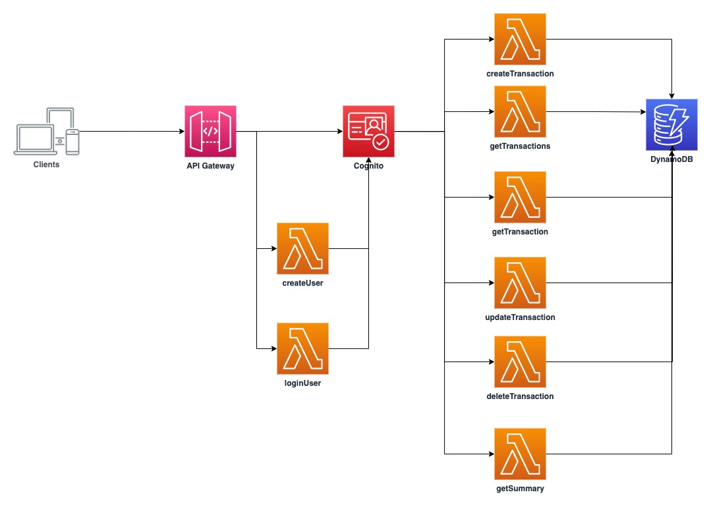
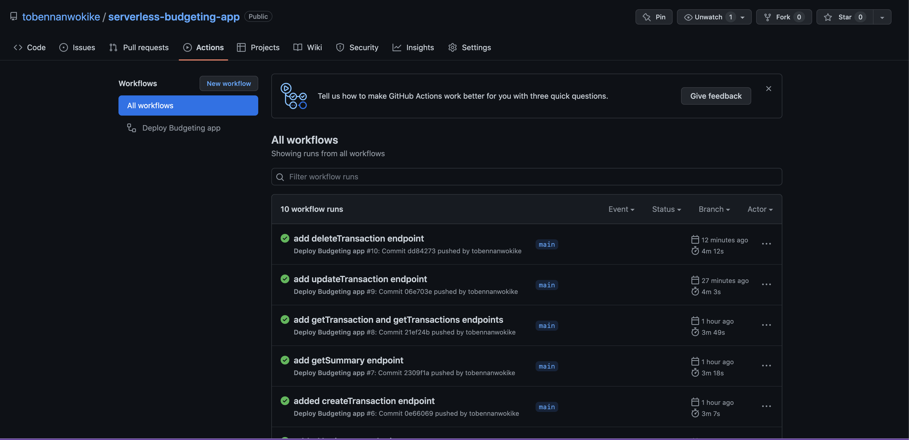
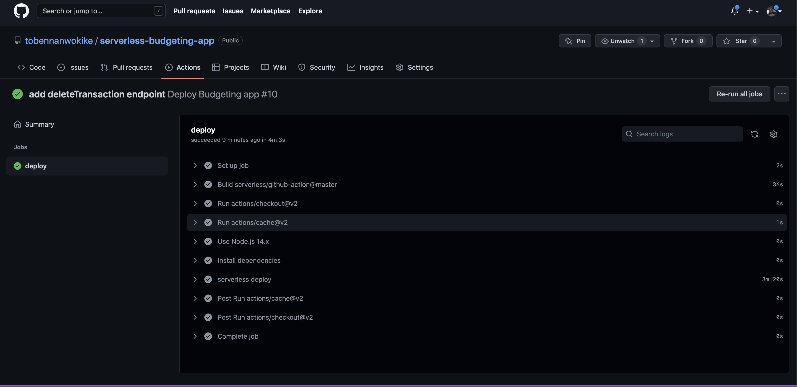

# Budgeting App

## Overview

A couple of weeks ago, I noticed that my monthly spending had gone up and I decided to keep track of my spending using a physical log book just to see where most of my funds were being spent. On a second thought, I resolved to switch to a mobile app or website (Heck! I'm a tech. bro 😏) but on checking through the app store, I couldn't really find anything that addressed my problem. I needed a solution that simply allowed me to enter my income (credits) and expenses (debits) on a daily basis. The solution would also show me a summary of my total income, total expenses and profits i.e. total income - total expenses. The apps that I found were way too complex. 

After speaking with a number of my colleagues, I realised that a lot of them were also looking for a similar solution and as such, I chose to build a simple solution that addresses this need.

This project serves as the starting point for a simple budgeting app that allows users to track their income and expenses on a daily basis. It is not the finished product yet and I plan to build on this idea to include features such as reminders, reporting and others in the near future.

## Solution Design

## ENTITIES
- [x] User
- [x] Transaction
- [x] Summary

#### User

- A User should be able to create, read, update and delete transactions as well as view a summary of their transactions

#### Transaction

- Transactions represent the daily credits and debits as entered by the user.

#### Summary
 - The user should be able to view a summary of their credits and debits which are based on their transactions
 
 

#### Attributes

##### User attributes

- Email (PK)
- Password

##### Transaction attributes

- Transaction ID (PK)
- Amount
- Category
- Title
- User ID (SK)
- Created At
- Updated At

##### Summary attributes

- User ID (PK)
- Total Credit
- Total Debit
- Created At
- Updated At

## Design Overview
This api is built as a serverless REST api, using the [Serverless Framework](https://www.serverless.com/) for Infrastructure as Code, [Amazon API Gateway](https://aws.amazon.com/api-gateway/) for serverless REST API, [AWS Cognito](https://aws.amazon.com/cognito/) for authentication, Typescript as the runtime language, [AWS Lambda](https://aws.amazon.com/lambda/) for serverless compute and [AWS DynamoDB](https://aws.amazon.com/dynamodb/) as the serverless database for storing application data. GitHub Actions CI/CD pipeline is used to handle deployments and screenshots are included in the appendix section.

### Identified Endpoints
- createUser - to create a new user
- loginUser - to login a user
- createTransaction - to create a new transaction
- getTransaction - to get a single transaction
- getTransactions - to get a list of transactions
- updateTransaction - to update a single transaction
- deleteTransaction - to delete a single transaction
- getSummary - to get a summary of transactions

### Solutions Architecture

## Deployment Instructions

To deploy the application on AWS using the GitHub Actions CI/CD pipeline, you would need to set the following repository secrets as defined in the main.yml file:

- AWS_ACCESS_KEY_ID
- AWS_SECRET_ACCESS_KEY

<strong>**Please note that you would need to provide permissions to the IAM user on AWS for all resources listed in the serverless.yml file for the deployment to be successful**</strong>

## Appendix

## GitHub Actions CI/CD

See screenshots of CI/CD setup below.

## Postman Documentation

See link to Postman Documentation below if you would like to test out the API after deployment.  
https://documenter.getpostman.com/view/10489988/UzBmMSfw

## Remarks
Please feel free to raise a PR if you feel that any aspect of the project can be improved on. Thank you! 😄